# 8-Bit Carry Lookahead Adder - VLSI Project

## Abstract
Carry lookahead adder is an adder used to perform fast addition. We have learned about it in CPEN 311 and most of the information about it can be found in the book [1]. In contrast to the ripple adder which transfers the carry bits sequentially, the carry lookahead adder generates the carry bits in parallel for all of the full adder bits.

The circuit itself expands the outputs of the full adder to have two additional inputs:
1. **Propagate**: `P = A XOR B`
2. **Generate**: `G = A AND B`

Where A and B are single-bit inputs into the full adder. In addition to the adders, we create an additional combinational logic unit which takes the P and G from each full adder and calculates the carries of the X-bit adder. The calculation is done recursively for each carry bit, making this circuit substantially larger than a normal ripple adder.

The carries are generated as follows:
```math
    S_i = P_i \oplus C_i
```
```math
    C_{i+1} = G_i + P_i \cdot C_i
```

```math
    C_1 = G_0 + P_0 C_{in} 
```
```math
    C_2 = G_1 + P_1 C_1 = G_1 + P_1 G_0 + P_1 P_0 C_{in} 
```
```math
    C_3 = G_2 + P_2 C_2 = G_2 + P_2 G_1 + P_2 P_1 G_0 + P_2 P_1 P_0 C_{in} 
```
```math
    C_4 = G_3 + P_3 C_3 = G_3 + P_3 G_2 + P_3 P_2 G_1 + P_3 P_2 P_1 G_0 + P_3 P_2 P_1 P_0 C_{in}
```

---

## Circuit Implementation
To implement the full carry lookahead circuit, I built the building blocks for the circuit one by one. This section presents all the building blocks, their functionality, and how they were tested. Later sections present the testbench results and design considerations for each block.

All functionalities were tested individually for every block to verify logical operation using stimuli. After each block was tested, it was used to build a higher-level block. For example, an inverter was built and tested, then used to build an XOR gate which was also individually tested.

### Summary of Building Blocks
1. **Inverter gate** - 1 input, 1 output
2. **AND gate** - 2 inputs, 1 output
3. **OR gate** - 2 inputs, 1 output
4. **XOR gate** - 2 inputs, 1 output
5. **Full adder** - 3 inputs (`a`, `b`, `carryin`), 4 outputs (`sum`, `generate`, `propagate`, `carryout`)
6. **4-bit carry lookahead combinational logic** - 9 inputs (4 generate, 4 propagate, 1 carryin), 4 outputs (carryout 1-4)
7. **4-bit carry lookahead adder** - 9 inputs (`a1-4`, `b1-4`, `carryin`), 5 outputs (`sum1-4`, `carryout`)

---

## Schematics
### Inverter Gate
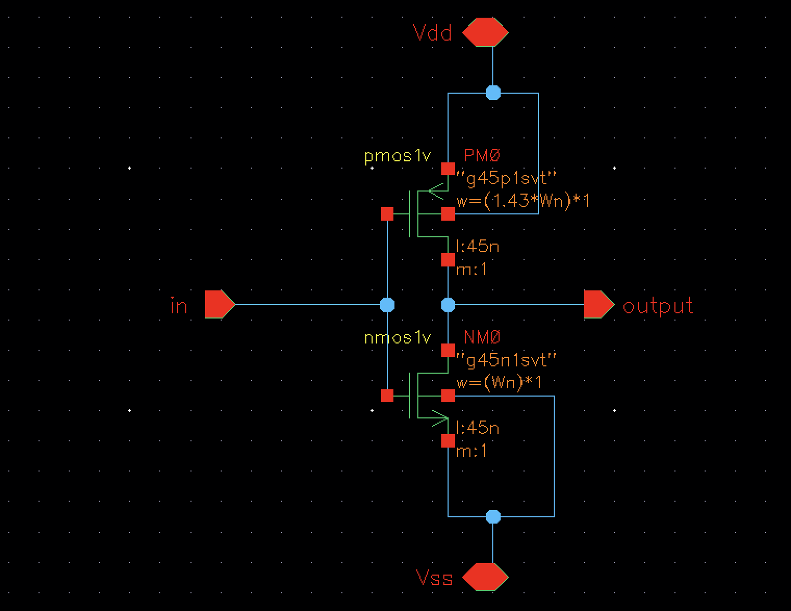

### AND Gate
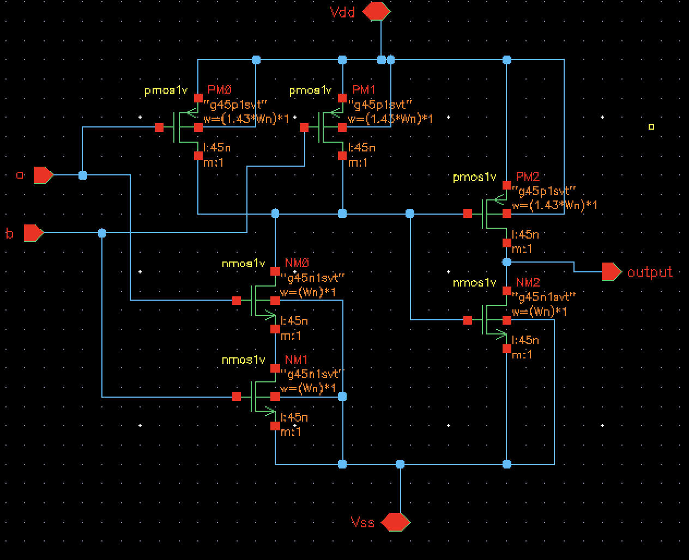

### OR Gate
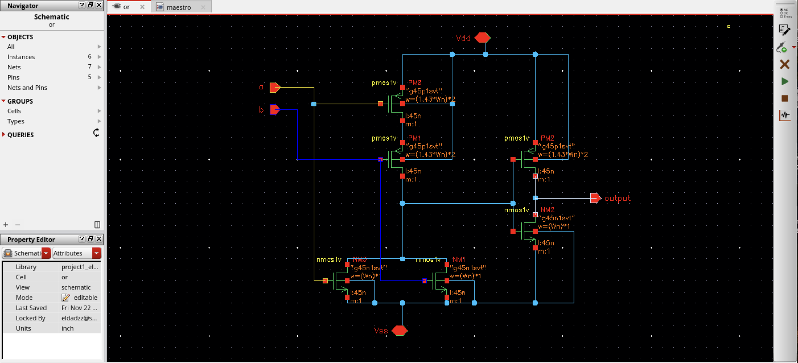

### XOR Gate
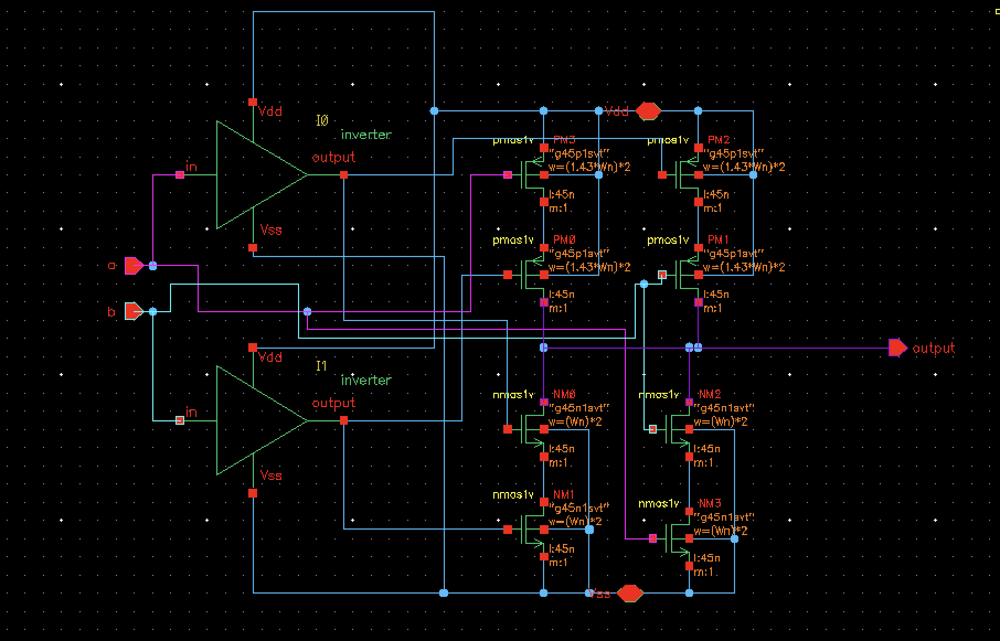

### Full Adder with Carry and Propagate
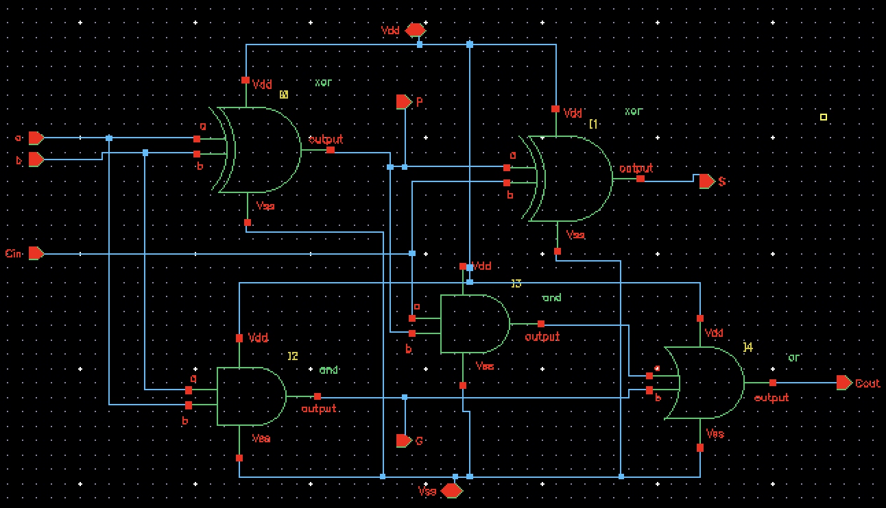

### Four-Bit Carry Lookahead Combinational Unit
#### Top
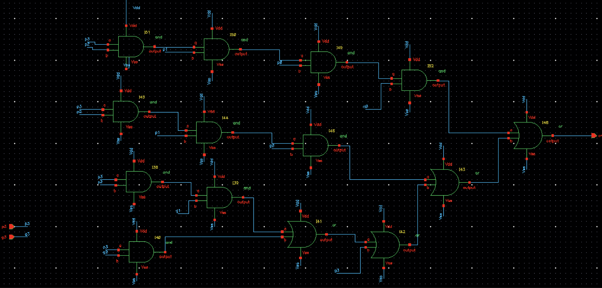
#### Middle
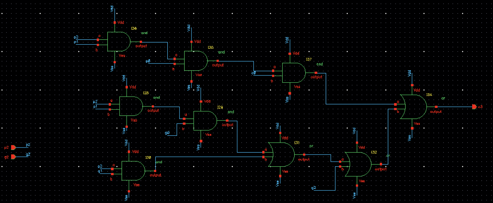
#### Bottom
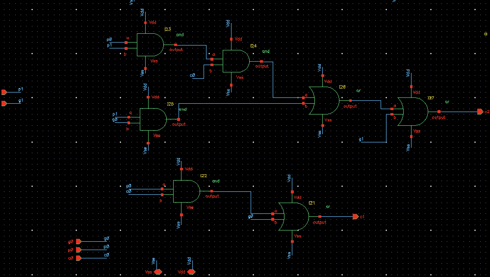

### Four-Bit Carry Lookahead Adder
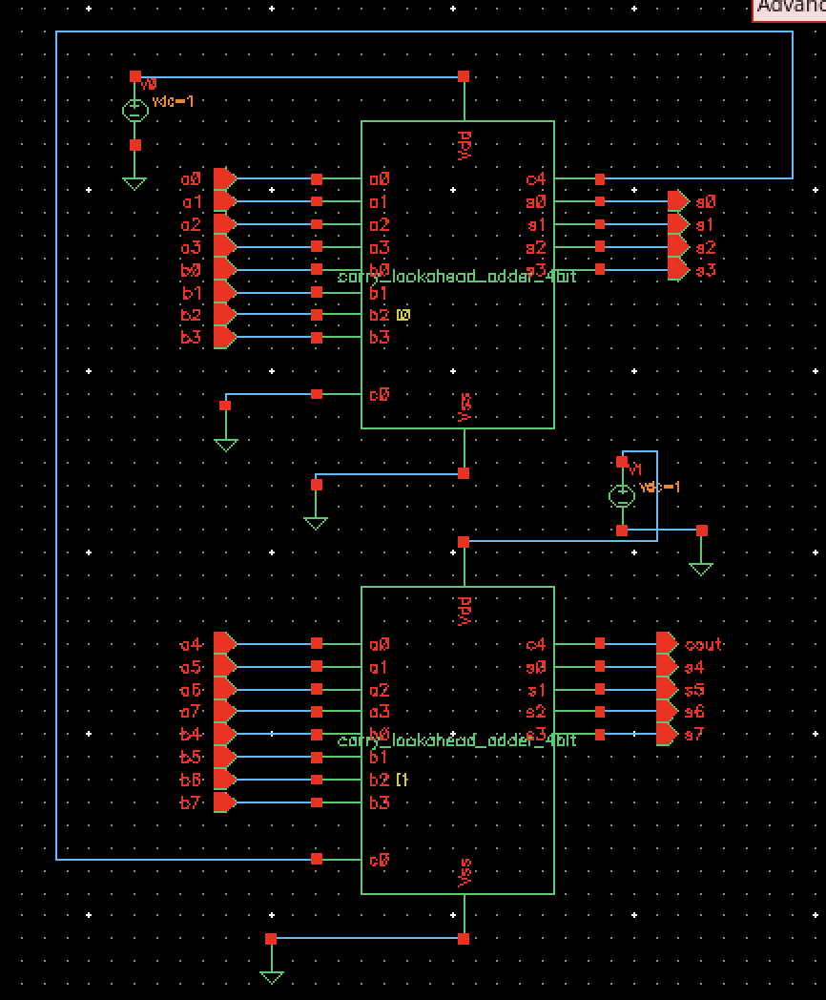

### Eight-Bit Carry Lookahead Adder


---

## Design Considerations and Techniques

### Multiple Input Gate vs Cascaded Two Input Gate
In the combinational unit of the carry lookahead adder, I decided to chain 2-input gates together instead of creating multiple-input gates. This minimizes the capacitance and resistance of the pull-up/pull-down network, reducing rise and fall times despite requiring more MOS devices.

---

## Simulation Results
Simulation results were divided into two categories:
1. **Verified using pattern matching of signal plotted in Python**, for blocks like:
   - Inverter
   - AND
   - OR
   - XOR
   - Full adder with propagate and generate

2. **Verified using assert statements in Python**, for blocks like:
   - Carry lookahead combination unit
   - 4-bit carry lookahead adder
   - 8-bit carry lookahead adder

### Verification Using Graphing
#### Inverter Gate
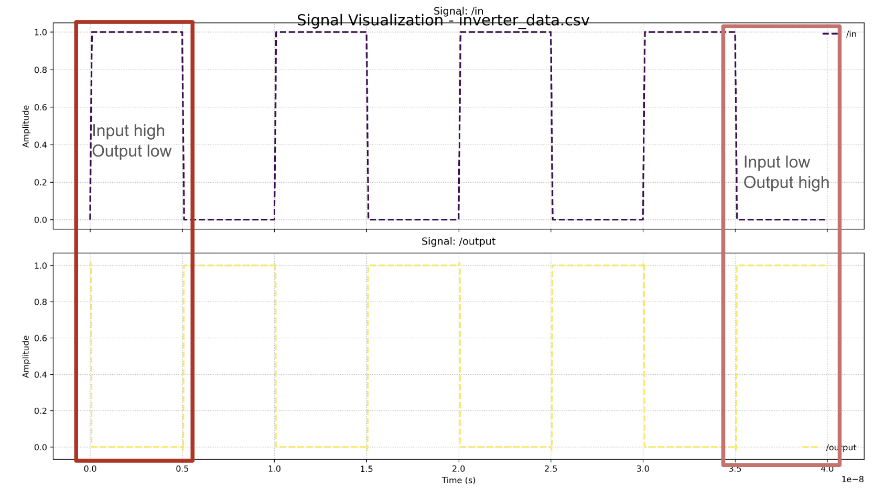

#### AND Gate
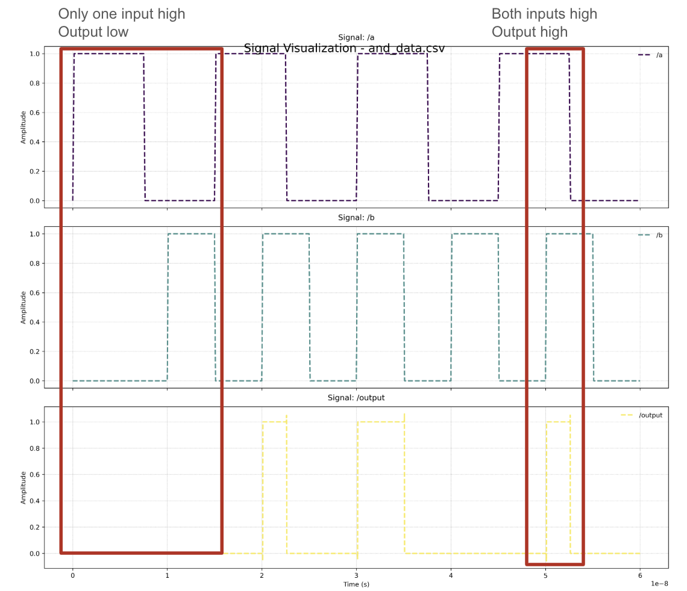

#### OR Gate
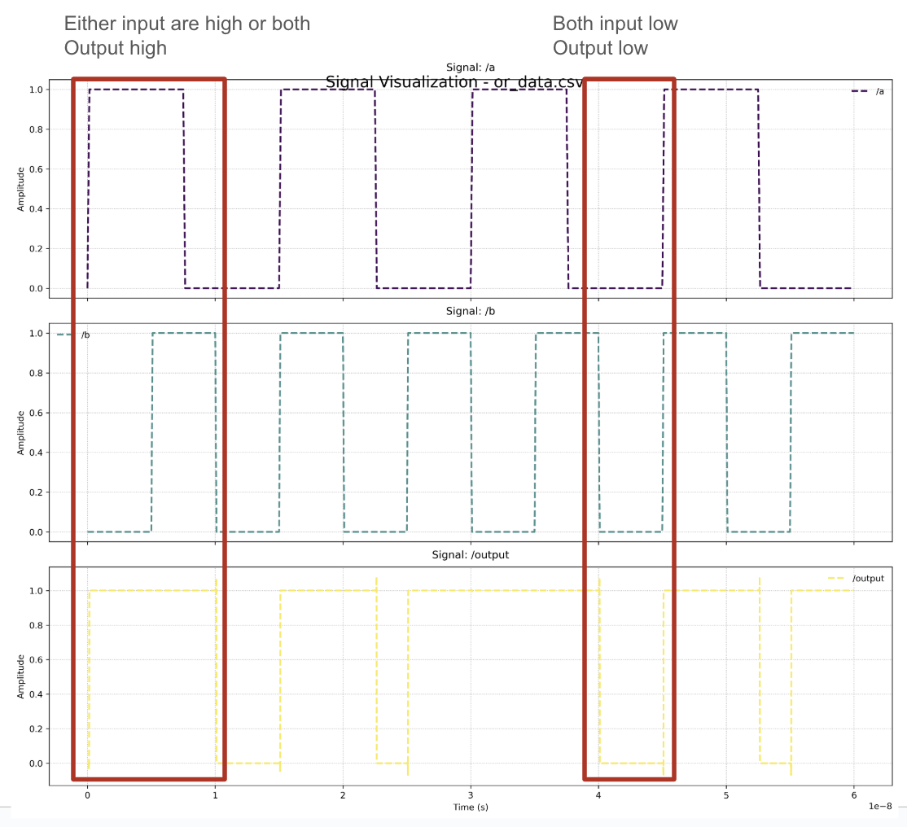

#### XOR Gate
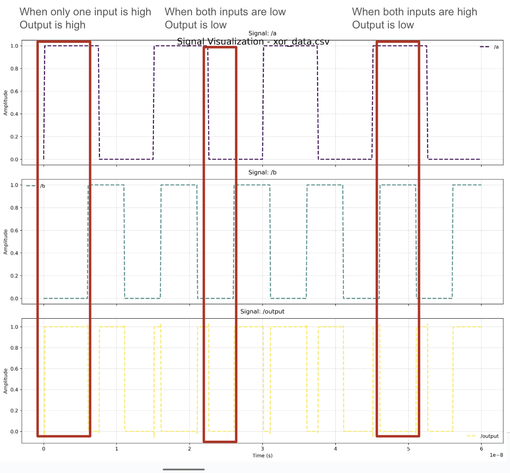

#### Full Adder with Carry and Propagate
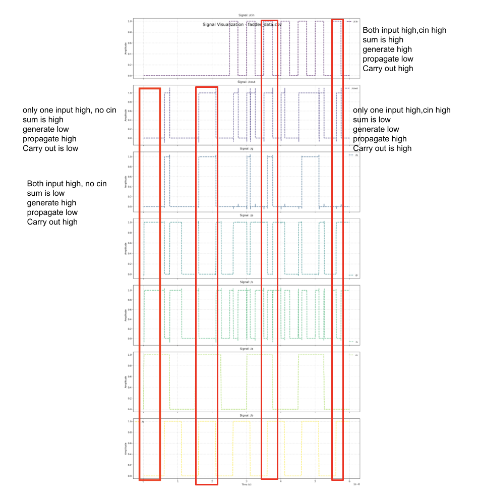

---

## Timing Simulation
The worst case timing occurs when `C4` is generated through the longest path involving 3 AND gates and 1 OR gate. The simulation calculated a maximum delay of ~0.257ns.

### Timing Verification
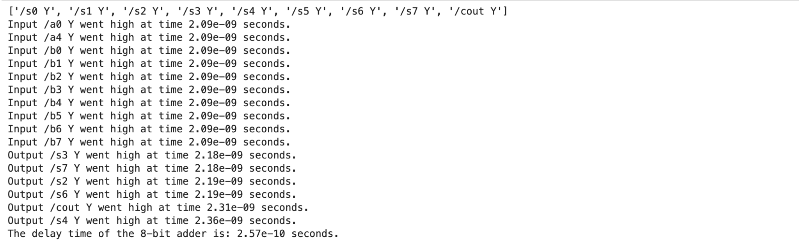

---

## Final Result
The metric achieved was delay time of 0.257 nanoseconds. This means that if this adder is the critical path of a system, the system can go at a maximum clock frequency of 1/delay which will allow a clock speed of 3.9 GHz.
---
## Appendix and Resources

### Simulation and Graphing Code
| Location                                | Description                                                                   |
|-----------------------------------------|-------------------------------------------------------------------------------|
| `sim/Graphing.ipynb`                    | Code graphing all CSV files in the folder `Graphing Data/`.                  |
| `sim/Carry Lookahead Comb Verification.ipynb` | Verification code for the 4-bit combinational unit of the carry lookahead adder. |
| `sim/4-Bit Adder Verification.ipynb`    | Verification code for the 4-bit carry lookahead adder.                       |
| `sim/8-Bit Adder Timing Simulation.ipynb` | Timing simulation code to find the worst-case delay in an 8-bit carry lookahead adder. |
| `sim/8-Bit Adder Verification.ipynb`    | Verification code for the 8-bit carry lookahead adder.                       |
| `Graphing Data/`                        | All simulation CSV files that don’t have automatic verification.             |
| `Simulation Data/`                      | All simulation files that have automatic verification.                       |

> **Note**: For better clarity, refer to the corresponding scripts or folders for detailed results.

### Cadence
The Cadence library can be found under `carry_lookahead_lib/`. All cells, schematics, maestro simulations, and symbols can be found there.


### Resources
- [GeeksforGeeks - Carry Lookahead Adder](https://www.geeksforgeeks.org/carry-look-ahead-adder/)
- [Wikipedia - Carry-lookahead Adder](https://en.wikipedia.org/wiki/Carry-lookahead_adder)
- [YouTube - Carry Lookahead Adder](https://www.youtube.com/watch?v=SQKdnxysXnw)
- Digital Design and Computer Architecture, David Harris
